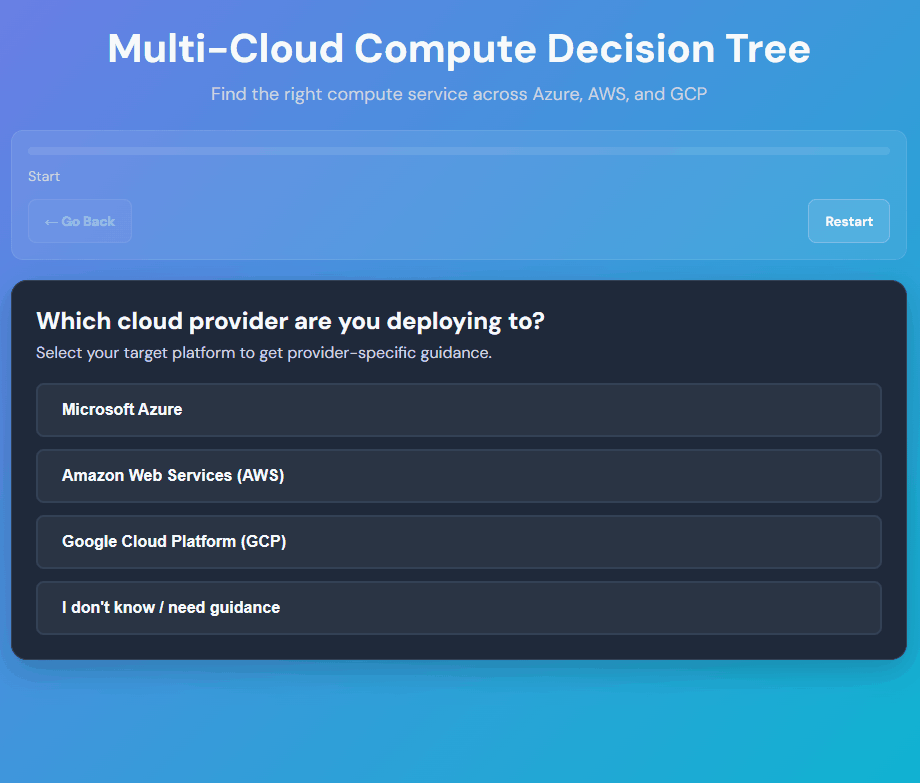

# textforge

> One spec. One compiler. Any interactive tool your domain expert can describe in plain text.

**textforge** is a Markdown-to-HTML compiler that turns structured specification files into fully interactive, self-contained decision trees — deployed in any browser, Confluence, SharePoint, or any platform that renders HTML — no server, no plugin, no approval process

Your domain expert writes the knowledge in plain text. The compiler encodes it once. It runs without them, forever.

---
## Why this exists

- Domain experts write knowledge in plain Markdown — no developer needed
- Deterministic compiler — same spec always produces same HTML, no AI at runtime
- Single self-contained HTML file — embed in Confluence, SharePoint, 
  any wiki, any browser
- Deep links, full-text search, keyboard navigation — production grade out of the box

## What It Looks Like



---

## Origin

This project started as a homework experiment — I asked an AI to build a best-in-class interactive learning tool for my daughter. What came back was more polished and better structured than anything our internal tooling had produced in years. That raised an obvious question: _why don't our internal tools meet this standard?_

For a deeper dive into the architectural philosophy behind this project, read the full article: [The Spec Is the Product. The Model Is Scaffolding.](https://medium.com/@ossian.ericson/the-spec-is-the-product-the-model-is-scaffolding-a78029c0062b)

textforge is shared as a community inspiration package, built entirely with AI assistance and with zero runtime AI dependency. The compiler is deterministic. The same spec always produces the same HTML. No model in the loop at runtime. No black box governance.

The core principle driving the architecture is one I have applied to infrastructure for 25 years:

> _If you can't reproduce it, you don't own it._

AI does not get an exemption from that rule. textforge uses AI extensively during development. It removes AI completely from the runtime.

---

## What It Produces

An interactive decision tree with:

- Clickable branching questions with progress tracking
- Rich result cards — best for, trade-offs, when NOT to use, responsibility model, links
- Deep links via a **Copy Link** button — paste directly into tickets, emails, or audit records
- Full-text search across all results
- Keyboard navigation and ARIA accessibility
- Zero server dependencies — a single HTML file, works in any browser or Confluence iframe

---

## Prerequisites

- **Node.js 22 or later** — newer LTS versions are expected to work
- npm 8+

---

## Quick Start (5 minutes)

```bash
# 1. Install dependencies
npm ci --ignore-scripts

# 2. Build TypeScript
npm run build

# 3. Setup (creates .env, installs hooks)
npm run setup

# 4. Compile the example tree
npm run compile

# 5. Run tests
npm test
```

Open `output/example-multicloud-compute-tree.html` in your browser. You should see a fully interactive multi-cloud compute decision tree covering 19 services across Azure, AWS, and GCP.

---

## How It Works

```text
spec.md ──▶ parsers ──▶ Zod validation ──▶ Handlebars template ──▶ output HTML
                                               ▲
                                    core/base-template.html
                                    core/badges.yml
```

```text
textforge/
├── decision-trees/
│   └── example-multicloud-compute/spec.md
├── quiz/
│   └── example-multicloud-compute/spec.md
```

1. You write a **spec file** (`decision-trees/<topic>/spec.md`) — a structured Markdown document defining questions, options, navigation, and result cards.
2. The **compiler** parses the spec, validates it against a Zod schema, and injects the data into a Handlebars template.
3. The output is a **single self-contained HTML file** — all CSS and JS inline — that works in any browser or Confluence iframe.

The intelligence lives in the spec. The compiler is scaffolding. Any domain expert who can describe a decision in plain text can build a production-grade interactive tool.

---

## Create Your Own Tree

Scaffold a new spec to avoid blank-page mistakes:

```bash
npm run init -- my-topic
```

This creates `decision-trees/my-topic/spec.md` and prompts you to choose a template (standard, dropdown, matrix, or blank). The smallest valid spec looks like this:

```markdown
### Q1: Start (id="q1")

**Title**: "Pick a path"
**Options**:

1. "Option A" → result: result-a
2. "Option B" → result: result-b
3. "I don't know / need guidance" → result: result-guidance
```

**Rules:**

- Every branching question must include an "I don't know" option — no dead ends
- Navigation uses Unicode `→` (not `->` or `=>`)
- Question IDs: lowercase, e.g. `q1`, `q2a`
- Result IDs: lowercase with hyphens, e.g. `result-compute`, `result-guidance`
- Result titles use a verb: "Use", "Deploy", "Provision"

For a full working example, see `decision-trees/example-multicloud-compute/spec.md` — a multi-cloud compute decision tree covering 19 services across Azure, AWS, and GCP.

Need more detail? See [docs/deep-dive.md](docs/deep-dive.md).

---

## Using AI to Generate a Spec

Every tree in this repo was designed using a reusable AI generator prompt — a structured
template you paste into any AI with your topic details. The AI writes the spec. The
compiler validates and builds it.

They work with any model (Claude, OpenAI, Gemini) and produce output the compiler accepts without manual cleanup.

```
docs/generators/
├── decision-tree-spec-generator-prompt.md  ← generate a new decision tree spec
└── quiz-spec-generator-prompt.md           ← generate a quiz or study set spec
```

Workflow:

```bash
# 1. Open the generator prompt, fill in the [FILL IN] fields at the top
#    (tree name, services, key questions to ask)

# 2. Paste into any AI — output is a ready-to-use spec.md

# 3. Save to decision-trees/<topic>/spec.md then validate and compile as normal
npm run validate:spec
npm run compile:topic -- <topic>
```

---

## Quiz Output Mode

Quiz output is a small prototype built in a few hours to show how easily another output type could be added to textforge.

```bash
npm run compile:quiz
```

The output is written to output/example-multicloud-compute-quiz.html.

---

## Deploying to Confluence

### 1. Upload the HTML

Open your Confluence page
Edit → "..." menu → Attachments
Upload: output/<topic>-tree.html

### 2. Add the iframe loader macro

Insert as a **HTML macro** on the Confluence page:

```html
<div
  style="background:white;border-radius:16px;padding:20px;box-shadow:0 4px 6px rgba(0,0,0,0.1);margin:20px 0"
>
  <iframe id="tree-iframe" style="width:100%;height:1400px;border:none;border-radius:8px"></iframe>
</div>

<script>
  AJS.toInit(function ($) {
    var pageId = AJS.Meta.get('page-id'),
      baseUrl = AJS.Meta.get('base-url');
    var fileName = 'example-multicloud-compute-tree.html'; // ⚠️ CHANGE THIS to your filename
    var url =
      baseUrl +
      '/download/attachments/' +
      pageId +
      '/' +
      encodeURIComponent(fileName) +
      '?cachebust=' +
      Date.now();

    $.ajax({ method: 'GET', url: url, dataType: 'text' })
      .done(function (data) {
        var doc = document.getElementById('tree-iframe').contentDocument;
        doc.open();
        doc.write(data);
        doc.close();
      })
      .fail(function () {
        console.error('Failed to load:', fileName);
      });
  });
</script>
```

### 3. Configure and publish

Update fileName to match your uploaded file (case-sensitive)
Adjust iframe height if needed (default: 1400px)
Publish

---

## Production Workflow

```bash
# 1. Edit your spec
decision-trees/<topic>/spec.md

# 2. Validate
npm run build && npm run validate:spec

# 3. Compile
npm run compile:topic -- <topic>

# 4. Review output in browser
open output/<topic>-tree.html

# 5. Deploy your HTML file to your platform of choice
```

Review against [decision-tree.rules.md](decision-tree.rules.md) before promoting to production.

---

## Command Reference

| Command                                                 | What it does                             |
| ------------------------------------------------------- | ---------------------------------------- |
| `npm run init -- <topic>`                               | Create a new spec from template          |
| `npm run compile`                                       | Build all trees                          |
| `npm run compile:watch`                                 | Auto-rebuild on spec or template changes |
| `npm run compile:topic -- <topic>`                      | Build one tree                           |
| `npm run compile:quiz`                                  | Build the example quiz HTML file         |
| `npm run compile:quiz -- --spec <path> --output <path>` | Build a quiz HTML file                   |
| `npm run validate:spec`                                 | Check for spec errors                    |
| `npm run validate:spec:fix`                             | Auto-fix common issues                   |
| `npm test`                                              | Run tests                                |
| `npm run lint`                                          | ESLint                                   |
| `npm run lint:fix`                                      | Auto-fix lint issues                     |
| `npm run ci`                                            | Lint + tests (CI gate)                   |
| `npm run build`                                         | TypeScript build                         |

If installed globally or via `npx`, the CLI is also available:

```bash
dtb init <topic>
dtb validate --fix
dtb compile --topic <topic>
dtb compile --watch
dtb compile --mode quiz --spec <quiz-spec.md> --output <output.html>
```

---

## Configuration

Defaults work out of the box. Override via `.env` if needed:

```bash
DTB_DECISION_TREES_DIR=decision-trees/   # Where specs live
DTB_OUTPUT_DIR=output/                   # Where HTML is written
DTB_TEMPLATE_PATH=core/base-template.html
DTB_BADGE_PATH=core/badges.yml
```

### Logging

- Default level: `info`
- JSON output: `LOG_FORMAT=json` or `LOG_JSON=true`
- Levels: `debug`, `info`, `warn`, `error`

---

## Programmatic Usage

```js
import { compileDecisionTree } from './dist/compiler/index.js';

compileDecisionTree({
  specPath: 'decision-trees/example-multicloud-compute/spec.md',
  templatePath: 'core/base-template.html',
  outputPath: 'output/example-multicloud-compute-tree.html',
});
```

`compileDecisionTree` throws `DecisionTreeCompilerError` with `code` and `suggestion` fields for all failure cases.

---

## Troubleshooting

| Symptom                              | Cause                                     | Fix                                                 |
| ------------------------------------ | ----------------------------------------- | --------------------------------------------------- |
| `→` arrows show as `?` or `â`        | File not saved as UTF-8                   | Re-save spec as UTF-8 without BOM                   |
| `npm run compile` exits with DTB-001 | Spec file not found                       | Check `decision-trees/<topic>/spec.md` exists       |
| `npm run compile` exits with DTB-002 | Template file not found                   | Verify `core/base-template.html` exists             |
| `npm run compile` exits with DTB-003 | Spec parse or Zod validation failed       | Run `npm run validate:spec` for details             |
| `validate:spec` reports arrow errors | Using `->` or `=>` instead of `→`         | Use Unicode `→` (U+2192) or run `validate:spec:fix` |
| `validate:spec` reports ID errors    | IDs use underscores or uppercase          | Use `q1`, `q2a`; `result-name` (lowercase, hyphens) |
| `husky install` error                | Husky v9 removed the `install` subcommand | Update `prepare` in `package.json` to just `husky`  |
| Node version error                   | Node.js below 22                          | Install Node.js 22 or later                         |

For error codes DTB-001 through DTB-999 and deeper debugging, see [docs/deep-dive.md](docs/deep-dive.md#error-codes).

---

## Questions

Open a GitHub Issue for questions and bug reports.
No SLA applies to this package.

---

## Engineering Standards

This project is built to production standards, not demo standards.

- **TypeScript strict mode** — no implicit `any`
- **Zod schema validation** — every spec field validated before compilation
- **80%+ test coverage gate** — the threshold below which AI-generated code cannot be trusted in production
- **ESLint + Prettier + Husky** — enforced on every commit
- **Conventional Commits** — readable history, self-writing CHANGELOG
- **Trunk-based development** — one branch, always shippable, CI gate before anything merges
- **Zero runtime AI dependency** — the compiler is deterministic; same spec always produces same output

---

## The Pattern

textforge demonstrates a reusable principle: AI at design time, deterministic compiler at runtime.

1. **Domain expert** — writes decisions in plain Markdown. No code needed.
2. **AI reasoning layer** — design time only. Pressure-tests logic, surfaces edge cases. Not present at runtime.
3. **Compiler** — deterministic, offline, owned by you. Same input, same output, always.

The same pattern applies to any structured knowledge domain: compliance checklists, onboarding wizards, incident runbooks, training flows, architecture guidance.

---
## Author

**Ossian Ericson**
* **Role**: Cloud Architect with 25+ years experience in mission-critical financial services.
* **Connect**: [LinkedIn](https://www.linkedin.com/in/ossian-ericson/)
* **Read**: [The Spec Is the Product. The Model Is Scaffolding.](https://medium.com/@ossian.ericson/the-spec-is-the-product-the-model-is-scaffolding-a78029c0062b) (Medium)

> **📣 Community Inspiration Package**
> textforge is published as a community inspiration package. It is shared as-is with no
> support, maintenance, or security update commitments. Teams that adopt it are
> responsible for their own fork, dependency management, and production readiness.

## License

MIT
