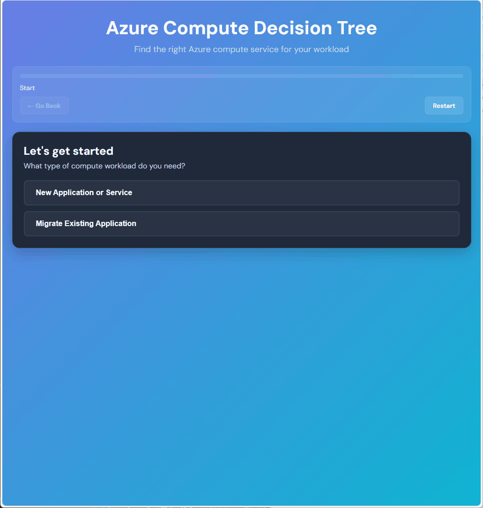

# textforge

> One spec. One compiler. Any interactive tool your domain expert can describe in plain text.

**textforge** is a Markdown-to-HTML compiler that turns structured specification files into fully interactive, self-contained decision trees and quizzes. The runtime is deterministic: the same spec produces the same HTML every time.

It is designed to run anywhere HTML can run: browser, wiki, SharePoint, Confluence, or static hosting. No server. No plugin. No runtime AI.

## Why This Exists

- Domain experts write knowledge in plain Markdown. The compiler turns it into a usable tool.
- The compiler is deterministic. There is no model in the loop at runtime.
- Output is a single self-contained HTML file with inline CSS and JavaScript.
- Deep links, search, keyboard navigation, and accessibility come built in.

## What It Looks Like



Live demo: [example multicloud compute decision tree](https://ossianericson.github.io/textforge/output/example-multicloud-compute-tree.html)

## Origin

This project started as a small experiment: use AI to design a better interactive learning tool, then keep the useful result and remove AI from runtime entirely.

The underlying principle is simple:

> _If you can't reproduce it, you don't own it._

textforge uses AI during design and development. It removes AI from the runtime and keeps the delivered artifact deterministic.

For the architectural philosophy behind that approach, see [The Spec Is the Product. The Model Is Scaffolding.](https://medium.com/@ossian.ericson/the-spec-is-the-product-the-model-is-scaffolding-a78029c0062b)

## What It Produces

An interactive output with:

- Branching questions with progress tracking
- Rich result cards with guidance, trade-offs, and links
- Deep links for sharing a precise point in the flow
- Full-text search across results
- Keyboard navigation and ARIA accessibility
- Zero server dependencies

## Prerequisites

- Node.js 22 or later
- npm 8+

## Quick Start

```bash
# 1. Install dependencies
npm install

# 2. Build TypeScript
npm run build

# 3. Compile the public examples
npm run compile:public

# 4. Run the public test suite
npm test

# Optional: run the full verification path including coverage
npm run test:full
```

After compile, open `output/example-multicloud-compute-tree.html` in your browser.

## Compile

```bash
npm run compile
```

This compiles every local decision tree under `decision-trees/**/spec.md` and every quiz under `quiz/**/spec.md`.

Outputs from scoped paths are flattened under `output/`, for example `output/internal-azure-compute-tree.html` and `output/public-example-quiz.html`.

To compile the public examples only:

```bash
npm run compile:public
```

That command builds the curated public release artifacts with the shipped output names:

- `decision-trees/public/example-multicloud-compute/spec.md`
- `quiz/public/example/spec.md`

## Examples

### Cloud Tree

- **File:** `output/example-multicloud-compute-tree.html`
- **What it is:** A fully interactive decision tree compiled from Markdown.

### Quiz

- **File:** `output/example-quiz.html`
- **What it is:** A standalone HTML quiz with scoring and result output.

## How Specs Work

The compiler reads a structured `spec.md`, validates it, and injects the parsed data into a versioned HTML renderer. The pattern is:

```text
spec.md -> parser -> schema validation -> renderer -> output HTML
```

```text
textforge/
├── decision-trees/
│   ├── public/example-multicloud-compute/spec.md
│   └── internal/<topic>/spec.md
├── quiz/
│   ├── public/example/spec.md
│   └── internal/<topic>/spec.md
```

Decision trees live under `decision-trees/`.
Quiz examples live under `quiz/`.
New internal trees should be created under `decision-trees/internal/` unless they are intentionally promoted to `decision-trees/public/`.
Quiz examples follow the same boundary: internal quiz content belongs under `quiz/internal/`, while public examples belong under `quiz/public/`.

## Pattern

The content model is the product. The compiler stays generic. Renderer profiles and per-topic `render.json` options allow output differences without forking the compiler for each tree.

The repository now follows a permanent content boundary:

- `decision-trees/public/` and `quiz/public/` hold the only example content intended for public release.
- `decision-trees/internal/` and `quiz/internal/` hold internal-only content.
- `docs/readme/internal.md` holds internal-only README additions used only in the internal view.
- `scripts/export-public.ts` and `scripts/internal-strings.ts` enforce the public release boundary.

## Create Your Own Tree

```bash
npm run init -- my-topic
```

This scaffolds a new spec under `decision-trees/<scope>/my-topic/spec.md`.

Use `npm run init -- my-topic --scope public` or `npm run init -- my-topic --scope internal` to choose the destination explicitly. The default scope depends on the repo layout.

The smallest valid branching question looks like this:

```markdown
### Q1: Start (id="q1")

**Title**: "Pick a path"
**Options**:

1. "Option A" → result: result-a
2. "Option B" → result: result-b
3. "I don't know / need guidance" → result: result-guidance
```

Key rules:

- Every branching question should include an "I don't know" path.
- Navigation uses the Unicode arrow `→`.
- Question IDs stay lowercase, for example `q1` or `q2a`.
- Result IDs stay lowercase with hyphens.

For a working public example, see `decision-trees/public/example-multicloud-compute/spec.md`.

Need more depth? See [docs/deep-dive.md](docs/deep-dive.md).

### New Tree Checklist

Use this flow when creating a brand-new tree:

```bash
# 1. Scaffold the topic
npm run init -- my-topic

# 2. Validate the spec
npm run validate:spec

# 3. Compile just that tree
npm run compile:topic -- <scope>/my-topic

# 4. Open output/<scope>-my-topic-tree.html in your browser

# 5. Run the stable compiler suite
npm test

# Optional: run the corpus-only smoke verification directly
npm run verify:corpus

# 6. Check overall coverage
npm run test:coverage
```

When you compile with an explicit scoped path, the generated file name is flattened under `output/`, for example `output/public-my-topic-tree.html` or `output/internal-my-topic-tree.html`.

To confirm the shipped baseline examples still work out of the box, run `npm run verify:public-examples`.

## Using AI to Generate a Spec

Generator prompts live under `docs/generators/` and are intended for design-time use only.

```text
docs/generators/
├── decision-tree-spec-generator-prompt.md
└── quiz-spec-generator-prompt.md
```

Typical workflow:

```bash
# 1. Fill in the generator prompt for your domain
# 2. Use any model to draft spec content
# 3. Save the result to decision-trees/<scope>/<topic>/spec.md

npm run validate:spec
npm run compile:topic -- <scope>/<topic>
```

## Direct Quiz Compile

```bash
dtb compile --mode quiz --spec quiz/public/example/spec.md --output output/example-quiz.html
```

Use this only when you want to compile one quiz spec directly instead of using the repository-level `npm run compile` or `npm run compile:public` commands.

## Test

```bash
npm test
```

This runs the shared compiler test suite, the internal output guardrail, and the corpus-level smoke checks for every discovered spec under `decision-trees/**/spec.md` and `quiz/**/spec.md`.

To run only the corpus-level compile verification:

```bash
npm run verify:corpus
```

To verify the shipped public example trees out of the box:

```bash
npm run verify:public-examples
```

That command checks the curated public baseline examples, including golden snapshot verification for the shipped public outputs.

Coverage output is intentionally kept separate from `npm test`:

```bash
npm run test:coverage
```

That command reruns the suite under `c8`, prints the coverage summary, and enforces the 80% gate. Keeping coverage out of the default `npm test` path keeps local iteration faster and the default output easier to scan when you are working on a new tree.

If you want one command that runs the normal suite and then prints the coverage summary, use:

```bash
npm run test:full
```

## Command Reference

| Command                            | What it does                                                         |
| ---------------------------------- | -------------------------------------------------------------------- |
| `npm run init -- <topic>`          | Create a new spec from template, defaulting to the internal scope    |
| `npm run compile`                  | Build all decision trees and quizzes in the local repository         |
| `npm run compile:public`           | Build only the public tree and quiz examples                         |
| `npm run compile:watch`            | Auto-rebuild decision trees and quizzes on spec or template changes  |
| `npm run compile:topic -- <topic>` | Build one tree by leaf name or nested path such as `public/my-topic` |
| `npm run validate:spec`            | Check for spec errors                                                |
| `npm run validate:spec:fix`        | Auto-fix common issues                                               |
| `npm test`                         | Run shared tests plus corpus smoke checks for all discovered specs   |
| `npm run test:full`                | Run `npm test` and then print/enforce coverage                       |
| `npm run verify:corpus`            | Compile every discovered tree and quiz spec with shared invariants   |
| `npm run verify:public-examples`   | Verify the curated public baseline tree and quiz examples            |
| `npm run test:coverage`            | Run the public-safe test suite with coverage checks                  |
| `npm run build`                    | TypeScript build                                                     |
| `npm run typecheck`                | Run the TypeScript compiler without emitting files                   |
| `npm run typecheck:tests`          | Type-check the test suite                                            |
| `npm run lint`                     | Lint the repository                                                  |
| `npm run lint:fix`                 | Fix lint issues where possible                                       |
| `npm run format`                   | Format supported source and docs files                               |

Run these commands from the cloned repository root.

## Configuration

Defaults work out of the box. Override via `.env` if needed:

```bash
DTB_DECISION_TREES_DIR=decision-trees/
DTB_OUTPUT_DIR=output/
DTB_RENDERER=html/default-v1
DTB_TEMPLATE_PATH=renderers/html/default-v1/template.html
DTB_BADGE_PATH=core/badges.yml
```

`DTB_TEMPLATE_PATH` is an override for a specific template file. In the normal flow, leave it unset and let the configured renderer choose the template.

### Logging

- Default level: `info`
- JSON output: `LOG_FORMAT=json` or `LOG_JSON=true`
- Levels: `debug`, `info`, `warn`, `error`

## Programmatic Usage

```js
import { compileDecisionTree } from './dist/compiler/index.js';

compileDecisionTree({
  specPath: 'decision-trees/public/example-multicloud-compute/spec.md',
  outputPath: 'output/example-multicloud-compute-tree.html',
});
```

`compileDecisionTree` throws `DecisionTreeCompilerError` with `code` and `suggestion` fields.

## Troubleshooting

| Symptom                              | Cause                                  | Fix                                                                                           |
| ------------------------------------ | -------------------------------------- | --------------------------------------------------------------------------------------------- |
| `→` arrows show as `?` or `â`        | File is not saved as UTF-8             | Re-save the spec as UTF-8 without BOM                                                         |
| `npm run compile` exits with DTB-001 | Spec file not found                    | Check that the target `spec.md` exists                                                        |
| `npm run compile` exits with DTB-002 | Template file not found                | Verify the selected renderer template exists, or check `DTB_TEMPLATE_PATH` if you override it |
| `npm run compile` exits with DTB-003 | Spec parse or schema validation failed | Run `npm run validate:spec`                                                                   |
| `validate:spec` reports arrow errors | Using `->` or `=>` instead of `→`      | Use the Unicode arrow or run `validate:spec:fix`                                              |
| Node version error                   | Node.js below 22                       | Install Node.js 22 or later                                                                   |

For deeper debugging, see [docs/deep-dive.md](docs/deep-dive.md#error-codes).

## Engineering Standards

- TypeScript strict mode
- Schema validation before compilation
- 80% coverage gate in `npm run test:coverage`
- ESLint, Prettier, and Husky hooks
- Zero runtime AI dependency

## Licence

See [LICENSE](LICENSE).

---

## Public Additions

In the public export, new topics should normally use the `public` scope. For example:

```bash
npm run init -- my-topic --scope public
npm run compile:topic -- public/my-topic
```

### Contributing

Open a pull request with a focused change, tests where behavior changes, and updated docs when the public workflow changes.

Public example content should stay minimal and generic. Internal trees, internal contacts, and internal deployment details do not belong in the public export.

### Questions

Open a GitHub Issue for bugs, questions, or discussion.

### Community Inspiration Package

textforge is shared as a community inspiration package. Teams that adopt it should own their fork, dependency management, security review, and production readiness.

### Author

**Ossian Ericson**

- **Role:** Cloud architect with 25+ years of experience in mission-critical financial services
- **Connect:** [LinkedIn](https://www.linkedin.com/in/ossian-ericson/)
- **Read:** [The Spec Is the Product. The Model Is Scaffolding.](https://medium.com/@ossian.ericson/the-spec-is-the-product-the-model-is-scaffolding-a78029c0062b)
