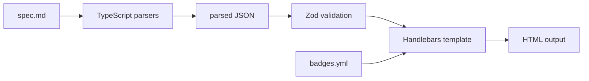

# textforge Deep Dive

This document collects the detailed workflow, architecture, and troubleshooting guidance for textforge.

Related references:

- [decision-tree.rules.md](../decision-tree.rules.md)
- [core/style-guide.md](../core/style-guide.md)

## Deterministic Workflow

Use [README.md](../README.md) for the supported commands and [decision-tree.rules.md](../decision-tree.rules.md) for authoring rules.

Notes:

- Badge colors are defined in [core/badges.yml](../core/badges.yml).
- Generator prompts live in [docs/generators](../docs/generators/).

## Repository Structure

```text
textforge/
├── decision-trees/
│   ├── internal/
│   └── public/
├── quiz/
│   ├── internal/
│   └── public/
├── docs/
│   ├── deep-dive.md
│   ├── generators/
│   └── readme/
├── compiler/
├── core/
├── renderers/
├── scripts/
└── tools/
```

## Compiler Flow



## TypeScript Pipeline

The compiler and parser pipeline are fully TypeScript and compile to dist/ for runtime use. Source lives under compiler/, and build output lives under dist/.

Quiz output mode is a secondary example output type. See the README for the current public example command and output location.

Renderer templates now live under `renderers/`, with `html/default-v1` as the default profile unless a topic or environment override selects something else.

---

## Generator Prompts

Reusable AI generator prompts live in `docs/generators/`:

| File                                     | Purpose                           |
| ---------------------------------------- | --------------------------------- |
| `decision-tree-spec-generator-prompt.md` | Generate a new decision tree spec |
| `quiz-spec-generator-prompt.md`          | Generate a quiz or study set spec |

Per-tree author notes can live outside the public boundary when needed.

## Tools

The validator lives in [tools/validate-spec.ts](../tools/validate-spec.ts) and compiles to dist/ for runtime use.

Checks:

- Arrow syntax (→ only, not -> or =>)
- Navigation target format (`go to` or `result:` prefix)
- Question ID format (q1, q2a — no underscores or dashes)
- Result ID format (result-servicename — lowercase, hyphens only)
- Required result sections (Best For, Key Benefits, Considerations, When NOT to use, Tech Tags, Additional Considerations)
- "I don't know"/"Unsure" option on button questions
- Info Box placement above Options
- Link formatting and navigation consistency
- Underscores in navigation targets
- progressSteps start/end values and even spacing to 80%
- UTF-8 without BOM
- Version header format
- Dropdown range contiguity (no gaps, no overlaps)
- Dropdown range target format

```bash
npm run validate:spec
npm run validate:spec:fix
```

Husky + lint-staged enforce ESLint and Prettier on staged source files. Run `npm run validate:spec` manually before committing spec changes.

## UX Enhancements (Optional)

- Dropdown questions: add `**Type**: dropdown` and a `**Dropdown**:` block with `Range:` lines.
- Search tags: add `**Search Tags:**` on result cards to improve search matching.
- Deep links: the template writes the navigation path into the URL hash; result cards include a “Copy Link” button.
- Validator checks dropdown ranges for overlaps and gaps.

## Output Directory Convention

```text
output/
├── example-multicloud-compute-tree.html
├── example-quiz.html
├── internal-azure-compute-tree.html
└── ...
```

See [decision-tree.rules.md](../decision-tree.rules.md) for the validation checklist.

## Production Workflow

1. Edit or add a spec under `decision-trees/internal/` or `decision-trees/public/`
2. Run `npm run build && npm run validate:spec`
3. Generate HTML to output/
4. Review against [decision-tree.rules.md](../decision-tree.rules.md)
5. Use `npm run export:public` when preparing a public release

`npm run export:public` is intentionally structure-first:

1. It verifies the command is running from the internal source repository.
2. It copies only an explicit public allowlist into `dist/public-export/`.
3. It writes the public `README.md` directly into the export snapshot.
4. It writes a reduced public `package.json` from an allowlist of scripts.
5. It scans the staged export for blocked internal strings and compiles the public examples.

## Troubleshooting

Common issues:

- Wrong arrow token (use U+2192 instead of -> or =>)
- Missing required sections in a result card
- Invalid IDs (q2_a, result_Service)
- Encoding issues (use UTF-8 without BOM)

### Platform Notes

**M1/M2 Mac:** Use `nvm` with the ARM-native Node.js build. If `npm install` hangs, run
`arch -arm64 npm install`. Verify with `node -e "console.log(process.arch)"` - expect `arm64`.

**Windows WSL2:** Set `git config core.autocrlf false` before cloning. If Husky hooks
fail with "permission denied", run `chmod +x .husky/*` inside WSL2. Use the WSL2 terminal
for all `npm run` commands; PowerShell is not supported.

## Error Codes

- DTB-001: Spec file not found
- DTB-002: Template file not found
- DTB-003: Spec parse or schema validation failed
- DTB-004: Template read failed
- DTB-005: Output write failed
- DTB-006: Navigation or progress validation failed
- DTB-007: Badge config missing or invalid
- DTB-999: Unknown compiler error

## Examples

- [decision-trees/public/example-multicloud-compute](../decision-trees/public/example-multicloud-compute/) — public decision tree example
- [quiz/public/example](../quiz/public/example/) — public quiz example

## Ownership and Support

- Core files: decision-tree.rules.md, core/, tools/
- Specs: owners of each topic under decision-trees/
- Public release flow: scripts/export-public.ts and scripts/internal-strings.ts
- HTML output: owners of output/

If unsure, start with [decision-tree.rules.md](../decision-tree.rules.md).
